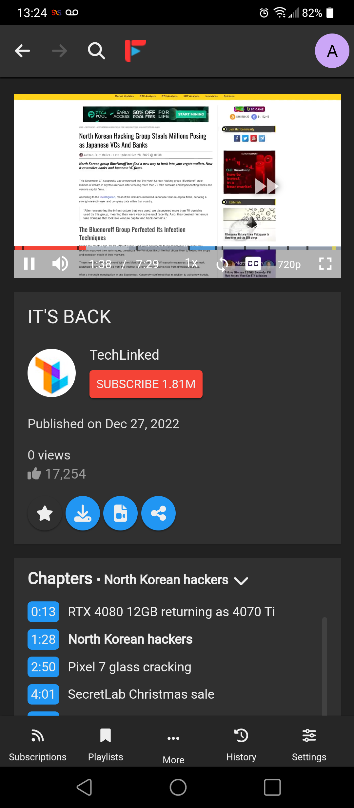

<p align="center">
 
</p>

FreeTube is an open source desktop YouTube player built with privacy in mind.
Use YouTube without advertisements and prevent Google from tracking you with their cookies and JavaScript.
Available for Windows (10 and later), Mac (macOS 12 and later) & Linux thanks to Electron.
<p align="center" >
 
</p>
<h2 align='center'>
An open source YouTube player built with privacy in mind.
</h2>

<p align='center'>
  <a href='https://github.com/MarmadileManteater/FreeTubeCordova/actions/workflows/buildCordova.yml'>
    
  </a>
  <a href="https://apt.izzysoft.de/fdroid/index/apk/io.freetubeapp.freetube">
    
  </a>
<a href="https://hosted.weblate.org/engage/free-tube/">

</a>
</p>
<hr>
<p align="center"><a href="#screenshots">Screenshots</a> &bull; <a href="#how-does-it-work">How does it work?</a> &bull; <a href="#features">Features</a> &bull; <a href="#how-to-build-and-test">Building and testing</a> &bull; <a href="#contributing">Contributing</a> &bull; <a href="#localization">Localization</a> &bull; <a href="#contact">Contact</a> &bull; <a href="#upstream-donations">Donate</a> &bull; <a href="#license">License</a></p>
<p align="center"><a href="https://freetubeapp.io/">Website</a> &bull; <a href="https://blog.freetubeapp.io/">Blog</a> &bull; <a href="https://docs.freetubeapp.io/">Documentation</a> &bull; <a href="https://docs.freetubeapp.io/faq/">FAQ</a> &bull; <a href="https://github.com/FreeTubeApp/FreeTube/discussions">Discussions</a></p>
<hr>

FreeTube Android is an open source YouTube player built with privacy in mind. Use YouTube without advertisements and prevent Google from tracking you with their cookies and JavaScript.
Available as an APK and as a PWA (progressive web app). FreeTube Android is a fork of [FreeTube](https://www.github.com/FreeTubeApp).

> [!NOTE]
> FreeTube Android is currently in Beta. While it should work well for most users, there are still bugs and missing features that need to be addressed.

<p align='center'>
  <a href='https://apt.izzysoft.de/fdroid/index/apk/io.freetubeapp.freetube'>
    
  </a>
</p>

<p align="center"><a href="https://github.com/MarmadileManteater/FreeTubeCordova/releases">Download FreeTube Android</a></p>

<hr>

## How does it work?
The APK uses a built in extractor to grab and serve data / videos, and can optionally use the [Invidious API](https://github.com/iv-org/invidious). The PWA *only* uses the Invidious API. No official YouTube APIs are used to obtain data. Your subscriptions and history are stored locally on your device and are never sent out.

## Features
* Watch videos without ads
* Use YouTube without Google tracking you using cookies and JavaScript
* Subscribe to channels without an account
* Connect to an externally setup proxy such as Tor
* View and search your local subscriptions, playlists and history
* Organize your subscriptions into "Profiles" to create a more focused feed
* Export & import subscriptions
* Youtube Trending
* Youtube Chapters
* Most popular videos page based on the set Invidious instance
* SponsorBlock 
* Full Theme support
* Keyboard shortcuts
* Option to show only family friendly content
* Show/hide functionality or elements within the app using the distraction free settings

Go to [FreeTube's Documentation](https://docs.freetubeapp.io/) if you'd like to know more about how to operate FreeTube and its features.

## Screenshots
  


### Automated Builds (Nightly / Weekly)
Builds are automatically created from changes to our development branch via [GitHub Actions](https://github.com/MarmadileManteater/FreeTubeCordova/actions/workflows/buildCordova.yml).

The first build with a green check mark is the latest build. You will need to have a GitHub account to download these builds.

## How to build and test
### Commands for the APK
```bash
# 📦 Packs the project using `webpack.android.config.js`
yarn pack:android
# 🤖 Packs the botguard script
yarn pack:botGuardScript:android
# 🚧 for development
yarn pack:android:dev
```
> [!NOTE]
> These extensions do not work on Linux portable builds!
>
> If you have issues with the extension working with FreeTube, please create an issue in this repository instead of the extension repository.

## Download Links
### Official Downloads

> [!CAUTION]
> FreeTube is only supported on Windows 10 and later, macOS 12 and above, and various Linux distributions. Installing it on unsupported systems may result in unexpected issues.

* [GitHub Releases](https://github.com/FreeTubeApp/FreeTube/releases)

* [FreeTube Website](https://freetubeapp.io/#download)

* Flatpak on Flathub: [Download](https://flathub.org/apps/details/io.freetubeapp.FreeTube) and [Source Code](https://github.com/flathub/io.freetubeapp.FreeTube)

#### Automated Builds (Nightly / Weekly)
> [!WARNING]
> Use these builds at your own risk. These are pre-release versions and are only intended for people that want to test changes early and are willing to accept that things could break from one build to another. 

Builds are automatically created from changes to our development branch via [GitHub Actions](https://github.com/FreeTubeApp/FreeTube/actions?query=workflow%3ABuild).

The first build with a green check mark is the latest build.  

> [!IMPORTANT]
> You will need to have a GitHub account to download these builds.

### Unofficial Downloads
> [!WARNING]
> These builds are maintained by the community. While they should be safe, download at your own risk. There may be issues with using these versus the official builds. Any issues specific with these builds should be sent to their respective maintainer. Make sure u always try an [official download](https://github.com/freetubeapp/freetube/#official-downloads) before reporting your issue to us!

* Arch User Repository (AUR): [Download](https://aur.archlinux.org/packages/freetube-bin/)

* Chocolatey: [Download](https://chocolatey.org/packages/freetube/)

* FreeTubeAndroid (FreeTube port for Android and PWA): [Download](https://github.com/MarmadileManteater/FreeTubeAndroid/releases) and [Source Code](https://github.com/MarmadileManteater/FreeTubeAndroid)

* Homebrew Formulae (Mac only): [Download for Apple Silicon](https://github.com/PikachuEXE/homebrew-FreeTube)

* makedeb Package Repository (MPR): [Download](https://mpr.makedeb.org/packages/freetube-bin)

* Nix Packages: [Download](https://search.nixos.org/packages?query=freetube)

* PortableApps (Windows Only): [Download](https://github.com/rddim/FreeTubePortable/releases) and [Source Code](https://github.com/rddim/FreeTubePortable)

* Scoop (Windows Only): [Usage](https://github.com/ScoopInstaller/Scoop)

* Snap: [Download](https://snapcraft.io/freetube) and [Source Code](https://git.launchpad.net/freetube)

* WAPT: [Download](https://wapt.tranquil.it/store/tis-freetube)

* Windows Package Manager (winget): [Usage](https://docs.microsoft.com/en-us/windows/package-manager/winget/)

> These commands only build the assets necessary for the project located in `android/` to be built. In order to obtain a complete build, you will need to build the project located in `android/` with `gradle`.
### Commands for the PWA
```bash
# 🐛 Debugs the project using `webpack.web.config.js`
yarn dev:web
# 📦 Packs the project using `webpack.web.config.js` 
yarn pack:web
```

### Commands for the PWA Docker Image
```bash

# 💨 Creates and runs the image locally. Add `--platform=linux/arm64` to docker build for ARM64 devices including Apple Silicon
docker build -t freetubecordova . # Warning, might take a while on Apple Silicon
docker run --name ftcordova -d -p 8080:80 freetubecordova

# ⬇ Pulls the latest from the Github Container Registry (ghcr.io)
docker pull ghcr.io/marmadilemanteater/freetubecordova:latest
# 👟 Runs the image from ghcr.io
docker run --name ftcordova -d -p 8080:80 ghcr.io/marmadilemanteater/freetubecordova:latest

# 🏃 Runs the image from Docker Hub.
docker run --name ftcordova -d -p 8080:80 owentruong/freetubecordova:latest

# 🏃‍♂️ Runs the image from Docker Hub (ARM64)
docker run --platform=linux/arm64 --name ftcordova -d -p 8080:80 owentruong/freetubecordova:latest-arm64
```
## Contributing

**NOTICE: MOST CHANGES SHOULD PROBABLY BE MADE TO [UPSTREAM](https://www.github.com/freetubeapp/freetube) UNLESS DIRECTLY RELATED TO CORDOVA CODE OR WORKFLOWS.**

If you like to get your hands dirty and want to contribute, we would love to
have your help.  Send a pull request and someone will review your code. Please
follow the [Contribution
Guidelines](https://github.com/MarmadileManteater/FreeTubeCordova/blob/development/CONTRIBUTING.md)
before sending your pull request.


## Localization
<a href="https://hosted.weblate.org/engage/free-tube/">

</a>

If you'd like to localize FreeTube Android, please send submissions to [FreeTube's weblate](https://hosted.weblate.org/engage/free-tube/).

## Contact
If you ever have any questions, feel free to make an issue here on GitHub. 

## Donations
If you enjoy using FreeTube Android, you're welcome to leave a donation using the following methods to support development and maintenance.  
* [Liberapay](https://liberapay.com/MarmadileManteater) _(goes to creator of FreeTubeAndroid)_
* Bitcoin Address: `1Lih7Ho5gnxb1CwPD4o59ss78pwo2T91eS` _(goes to upstream maintainers)_

While your donations are much appreciated, only donate if you really want to. Donations are no strings attached and do not come with the expectation of having your requests fulfilled.

## License
[](https://www.gnu.org/licenses/agpl-3.0.html)  

FreeTube is Free Software: You can use, study share and improve it at your
will. Specifically you can redistribute and/or modify it under the terms of the
[GNU Affero General Public License](https://www.gnu.org/licenses/agpl-3.0.html) as
published by the Free Software Foundation, either version 3 of the License, or
(at your option) any later version.  
