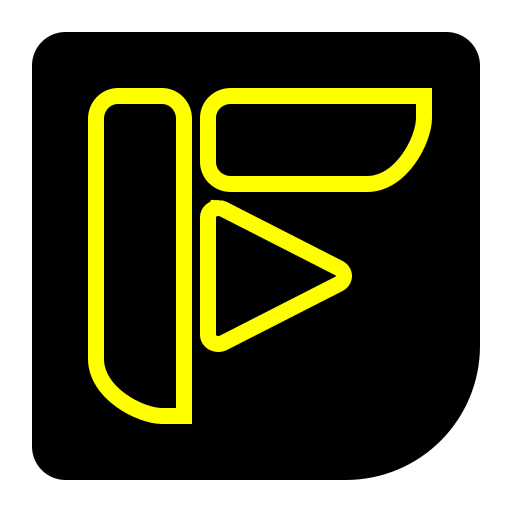

<div align="center">



# 白い熊 自由動画

**A private YouTube client — on the desktop *and* on the phone, from one repo.**

白い熊's fork of [FreeTube](https://github.com/FreeTubeApp/FreeTube) (AGPL-3.0) with the
Android layer of [FreeTubeAndroid](https://github.com/MarmadileManteater/FreeTubeAndroid)
grafted on and maintained against the current FreeTube development tip, plus **major
additions**: a one-tap **language-study export** (subtitled mkv into
[shiroikuma-jisho](https://github.com/ShiroiKuma0/shiroikumanojisho) /
[shiroikuma-yosuga](https://github.com/ShiroiKuma0/shiroikuma-yosuga)), a **video download**
button that writes chapter-preserving mkv files, original-language titles & descriptions, a
**self-teaching** channel-discovery **Similar** tab, **feed-filter pills** that carve a flooded
subscription feed into one-tap views, per-profile video **starring**, an automatic **device sync**
that keeps the watch history, subscriptions and starred videos the same on the phone and the PC,
live grid zoom with tuning sliders, theatre mode on Android, full-width views, a sister-repo-style
UI theming layer, and a **one-zip backup** of the whole app that a sister automation app can
trigger unattended.
Every release builds **both** artifacts:

- **GNU/Linux amd64 `.deb`** (Electron; installable on Tuxedo OS / Ubuntu / Debian)
- **Android arm64-v8a APK** (native Kotlin WebView wrapper; installs side-by-side with any
  other client as package `shiroikuma.jiyudoga`)

**📥 Latest release: [`0.25.2+2026-08-15.10-22.g1e195258+2026-08-12.20-35.gc42fee2c+029`](https://github.com/ShiroiKuma0/shiroikuma-jiyudoga/releases/latest)** — [all releases & downloads »](https://github.com/ShiroiKuma0/shiroikuma-jiyudoga/releases) · [changelog »](CHANGELOG.md)

</div>

---

## 🎓 One-tap language-study export

The killer feature for language learners: a graduation-cap button on every watch page turns
the video into study material. It downloads the clip and builds **two subtitle tracks** from
YouTube's caption timing — the raw auto-captions, and (when the description carries a
verbatim transcript, as Japanese news channels do) a **corrected track** where the ASR's
homophone-kanji errors are spliced away using the description text, per cue, without ever
touching the native timing. Everything is muxed into a single standard `.mkv` (SubRip
tracks, mkvmerge-grade structure) saved to your study folder — then the right study player
opens automatically: **shiroikuma-jisho** on Android (via intent), **shiroikuma-yosuga**
(our Memento fork) on the desktop. Replay line by line, tap words for dictionary lookups —
from news feed to language lesson in one tap.

## ⬇️ Download videos — as mkv, with the chapters intact

A download button sits beside the share icon on every watch page. It grabs the best
video-only and audio-only streams YouTube will hand over — the `bestvideo+bestaudio` of
`yt-dlp`, and the reason the output is Matroska, since YouTube pairs mp4/AVC video with
WebM/Opus audio, a combination mp4 cannot legally hold — and passthrough-remuxes them into
one file without re-encoding a single frame. When a session serves playback over SABR and
hands out no fetchable stream URLs, it falls back through Invidious to the muxed progressive
stream rather than failing.

The point of the exercise is **chapters**. YouTube's chapter markers are written into the
file as a real Matroska `Chapters` element, so mpv, VLC and mpvEx list them, mark them on the
seekbar and jump between them. Getting that right meant hand-building the EBML and putting it
*ahead of the first cluster* — players parse level-1 elements only that far and resolve
anything later through a fixed-size SeekHead — then correcting every byte offset the
insertion shifts.

Files land in a folder you're asked for once (SAF picker on Android, native picker on the
desktop) under a **`yt-dlp` style filename template** you can edit, previewed live in the UI
settings page:

```
%(title)s %(upload_date)s (%(channel)s).%(ext)s
→ Monster Kettlebell Workout Motivation. Lift 100kg … 2022-07-02 (WestportBattlebells).mkv
```

## 🈶 Original-language titles & descriptions

YouTube silently translates video titles — and descriptions — server-side into the request
language: a Japanese or Russian video shows up with a machine-translated English title and
description. This fork restores the **original text everywhere**: every visible video tile
resolves its untranslated title through YouTube's oEmbed endpoint (cached, throttled, zero
extra requests for tiles you never scroll to), and the watch page reads the player
response, which always carries the original — title *and* description (links and
timestamps stay clickable). Watch a trilingual feed — 日本語, русский, English — and every
word is the one its creator wrote.

## 🧭 Similar tab — discovery that learns what you don't want

Every profile groups subscriptions by topic; the **Similar** tab in Subscriptions turns that
into a discovery engine. It seeds from the profile's starred videos and the newest videos
across its channels, collects YouTube's "watch next" recommendations for each, drops every
channel you already follow, and shows the rest — related videos from **channels you don't
know yet**, matched to the profile's topic.

What makes it usable is that it **takes correction**. Suggestions are ranked by how many of
your own videos led to the same one, since agreement between seeds is a far better relevance
signal than recency; each tile says **which of your channels it came from**, so a bad
suggestion is traceable rather than mysterious. Two buttons on every tile act on it: block
the channel outright, or ask for fewer videos like this one — which hides that video, learns
the words its title was phrased with (character bigrams, so Japanese works without a
tokeniser) and holds the seed that produced it responsible; a seed that keeps producing
rejects stops seeding altogether. Nothing generalises off a single tap — a pattern has to
repeat before it filters — and every action is undone by tapping its toast. All of it is
stored per profile, so a channel that is noise for one topic stays welcome in another,
reviewable and removable item by item in the UI settings page, and it travels with your
profiles on backup and import.

## 🔻 Feed filter pills — one tap per view

Keep tens of topical profiles and one of them drowns the rest: a news profile alone can fill
the first hundreds of tiles of "All Channels", date-descending, and nothing else is visible.
Building a narrower view used to mean creating a profile and hand-deselecting channels one
by one — a second channel set to keep in sync forever.

Your profiles are already named channel sets, so the filter is **set algebra over them**. The
top bar carries a strip of named **pills**; the **+** beside it opens a panel where every
profile cycles **neutral → + → − → cap N**: `+` shows it, `−` hides it, and a **cap keeps the
group but thins it to its N newest videos per channel** — the answer to flooding that doesn't
delete the content. With no `+` anywhere the active profile is the base, so `− japan-news`
alone means "what I have active, minus the news".

The same panel carries one rule that isn't about profiles: **hide upcoming** drops the
premieres and scheduled streams a channel queues up, which otherwise sit at the top of a
date-descending feed for days before there is anything to watch. It rides along in the pill,
and it runs before the caps, so a capped channel spends its N on videos that actually play.

Name it and it becomes a pill. **Tap** to apply it (it fills with the accent colour, so which
view you're in is never a guess), tap again to leave. **Hold** to pick a pill up: move it
sideways to reorder the strip, let go without moving to delete it — with a tap-to-undo toast.
**Keep holding** — or right-click, on the desktop — and the pill opens for **editing**: it is
applied while you rework it, so the channel count and the feed below answer for every change
before you save it back over the same pill. Switching pill or profile puts the feed back at
the top, rather than stranding you in page four of a feed that no longer exists. The strip
scrolls when the pills outgrow the bar, and picking any profile clears the filter. It applies
to the feed alone: subscribing, starring and Similar tuning always land in the active profile,
never in whatever you happen to be looking at.

The "All Channels" bubble also stops reading `A`: it's whatever you set — `全` out of the box.

## ⭐ Star videos, per profile

A star button on the watch page (in front of "+") marks any video or short as starred in
the active profile. Starred videos carry a gold star on their tile thumbnails, and the
**Starred** tab collects them per profile, newest-starred first — a lightweight favorites
layer that travels with your profiles on export and sync.

## 🔍 Live grid zoom + tuning sliders

Resize the video grid **on the fly**: `Ctrl` + mouse wheel on the desktop (laptop touchpad
pinch works too), two-finger pinch on Android. Thumbnails, titles and info lines scale
together and the column count reflows; the chosen size (0.4×–3×) persists per device. A
sliders popup next to the Subscriptions heading tunes the bases the zoom multiplies:
thumbnail width, title font size and **title max lines** (so big fonts don't make tiles
arbitrarily tall) — plus a matching slider for the Profile Select row padding, right in the
dropdown.

## 🎭 Theatre mode everywhere

Theatre mode works on Android exactly like on the PC — pinned into the player's bottom row,
functional at every viewport width (upstream silently disabled it on scaled mobile
viewports): the video stretches across the full row and Up Next moves below.

## 🖥️ Full-width, unframed views

No wasted flanks: the browsing views — subscriptions, trending, search, channels, playlists,
history — fill the whole window instead of a bordered 85 %-wide card.

## 🎨 白い熊 自由動画 UI settings layer

A first-class Settings section in the sister-repo (denwa / messeji) style: foundation colors
(black `#000000` / yellow `#FFFF00`) with every other slot inheriting until overridden, RGBA
slider color rows with recent-color boxes, external `.ttf`/`.otf` font import with live
glyph preview, font-weight and UI-size sliders, and border / roundness / divider widths all
the way down to 0 — everything previewed live as you drag. The page itself is laid out like
the futokxkb keyboard UI page: thin hairlines between sections and headings underlined to
the width of the text, never the row. A long press on the hamburger opens it directly.

## 🔁 Device sync — the phone and the PC keep the same history

Watch half a video on the phone, sit down at the PC, and it resumes where you left it. The
**watch history with its resume positions**, the **subscriptions of every profile** and your
**starred videos** converge between the two devices, automatically: on opening the app, on
returning to it, and a few seconds after you leave a video. A sync button — a straight ⇄ with the word
beside it, so it is never mistaken for the feed-refresh button — sits in the Subscriptions and
History headings for when you want it now.

Each device publishes **one file** describing its own state and reads the other's — neither
ever writes the other's, so there is nothing to conflict. The **desktop is the only device
that reaches across**, over your own `ssh` (it reads `~/.ssh/config` itself; aliases, keys and
agents stay yours), which means the phone never opens a socket and nothing here can keep its
WiFi radio awake. It also means the PC can collect what the phone published **hours after the
phone's app was closed** — the two never have to be awake at the same moment.

Merging is per record, by when it was last modified, so the later watch position always wins
rather than whichever arrived last. Deletions are remembered rather than inferred: unsubscribe
a channel on one device and it **stays** unsubscribed instead of being handed back on the next
sync. Everything lands through the app's ordinary machinery, so both sides update in place —
**no restart**, unlike an import. Before the first merge, both databases are copied aside.

## 💾 One-zip backup, unattended if you want it

Export / Import sits at the top of that page, in the Kōjiki flow: pick a backup folder once,
tick what you want, and the **entire** app — every setting, sliced into ten logical groups,
plus profiles with their subscriptions, stars and Similar tuning, playlists, watch history and search
history — lands in a single timestamped `.zip`. Import merges it back and offers a restart.
The same export runs **headlessly**: sister apps can fire a token-gated intent at it, and
自由作業盤 backs up every app on the phone in one run, each reporting live counts and the
path and size it wrote. The export core is native, so it works with no window open at all.
Every item states whether it starts ticked rather than leaving the picker to guess, and a
中止 is a **real** cancel — the run unwinds at the next entry boundary and the half-written
archive is deleted, so a stopped backup leaves the folder exactly as it found it.

## 🔕 Nothing runs in the background unless you ask

The Android layer held a foreground service from the moment you first opened the app —
permanently, with a notification to match and no setting anywhere to stop it. Here it is a
switch in Settings › General, **off by default**: leave it off and the app stops when you
leave it, keep it on and playback survives being backgrounded at the cost of the
notification and of Android never letting the app doze. Flipping the switch starts or stops
the service immediately, so the notification comes and goes with it.

## 🍪 No YouTube tracking cookies on Android

FreeTube reads the YouTube watch page directly to start a video, and YouTube answers that
single request with six `Set-Cookie` headers — `VISITOR_INFO1_LIVE`, `__Secure-YENID` and
friends, two of them dated years out. The desktop app throws them away in Electron's
response hook; the Android layer had no equivalent, so on a phone they were kept and
replayed on every request afterwards, which is exactly the tracking identity a private
client exists to avoid. Here every WebView refuses cookies outright — sending as well as
storing — and anything an older build left behind is purged at launch. Nothing in the app
logs in or reads a cookie, so nothing is lost. Verified on-device rather than assumed: an
empty jar after a session of real playback.

## 📋 A console you can actually read

The Android layer captures every WebView console message, then hides the viewer in release
builds — which is every build anyone actually runs, so a JS error on a real phone was
invisible: nothing reaches logcat, and remote debugging is off. Here the **Console Log**
entry stays in the sidebar, and the viewer is built for reporting rather than squinting:
tap entries to select them, then copy those or the whole log to the clipboard, timestamped
and in the order things happened. It is what found the codec bug fixed in `+017`.

## 🔄 Own update channel

The built-in update check points at this repo's releases (with a version comparison that
understands the `<upstream>+<build>` scheme), so both the desktop app and the APK announce
new fork builds — never a stale upstream version. The build you are running is not a mystery
either: the full version — upstream base version, one commit pin per upstream, build counter —
sits in the top bar beside the app name, wrapping only between its `+` groups.

---

## What this fork is

- **Tracks both upstreams' `development` branches** — FreeTube's, always slightly ahead of the
  latest beta, and FreeTubeAndroid's, where their current work lands.
- **Dual upstream**: the desktop app comes from FreeTubeApp/FreeTube; the Android packaging
  layer comes from MarmadileManteater/FreeTubeAndroid and is adapted to the current FreeTube
  by this fork (including keeping the desktop Electron build alive, which the Android fork
  had dropped).
- **Rebranded** as 白い熊 自由動画 with a black-yellow outline-traced icon.
- Versioning: `<FORK_VERSION>+<FreeTube pin>+<FreeTubeAndroid pin>+<build>`, e.g.
  `0.25.2+2026-08-11.21-55.g86401956+2026-08-06.17-02.g4623e4a6+010`. A `+` opens each top-level
  group; a pin's own date, time and sha stay dot-joined, since all three describe one commit.

  **`FORK_VERSION` is the higher of the two upstreams' versions** — FreeTube's `package.json`
  version and FreeTubeAndroid's release tag — adopted after merging either (their fourth
  component is a packaging respin of the same FreeTube base, not a FreeTube version component).

  Because both upstreams are tracked **by branch, not by release**, neither version literal says
  which commit a build actually contains: FreeTube's `0.25.1` stands still across hundreds of
  development commits. So each upstream contributes a **base pin**,
  `+<base commit date>.<HH-MM>.g<8-char sha>` — the commit our layer sits on, from
  `git merge-base HEAD <ref>`, FreeTube first. The timestamp is the base commit's own committer
  time in **UTC**, never build time, so every build on one base shares a pin and version names
  still sort chronologically; it carries the **minute** because two syncs landing on one day would
  otherwise tie and hand the ordering to the random sha right behind it. Pins are recomputed from
  git at build time and never stored; each moves only when *its* upstream is synced, which is
  exactly the "this upstream has not moved" signal.

  The pinned string is also what the app reports about itself, so the in-app update check compares
  like with like against the release tag — but it compares only `FORK_VERSION` and the build
  counter, **stripping both pins from either side first**. Pins identify; they do not order. Their
  shape has changed twice, and rendering their timestamps in UTC moved one FreeTube commit's pin
  *backwards* by a day, which is exactly how a stale release once outranked the running build.

  Both artifacts always carry the same version, even when only one upstream moved. (One cosmetic
  exception: the `.deb`'s internal control field renders the pins' dates *and times* with `~`
  instead of `-`, because electron-builder sanitises `-` for deb/rpm targets. The `+` group
  separators pass through untouched, both filenames keep the hyphens, and the ordering is
  unaffected.)

  The build counter is zero-padded to three digits so releases and artifacts sort in build order,
  and **resets on every `FORK_VERSION` change**; Android
  `versionCode = ((maj*10000 + min*100 + patch) * 10 + respin) * 1000 + build` is untouched by the
  pins and keeps rising across that reset (`0.25.1+039` → `25010039`,
  `0.25.1.1+…+005` → `25011005`). Tags up to `0.25.1+37` predate the padding, those up to
  `0.25.1.1+001` predate the pins, and those up to `…g4623e4a6+006` carry the earlier dot-joined
  pins without the minute; all are left exactly as published.

## Branch model

| Branch | Role |
| --- | --- |
| `master` | Mirror of `FreeTubeApp/FreeTube` `development`, fast-forward only |
| `custom` | The fork: Android-layer graft + adaptations + branding + features |

Upstream refs the version pins are measured against:

| Upstream | Ref we follow | Pin |
| --- | --- | --- |
| `FreeTubeApp/FreeTube` | `development` (via local `master`) | first |
| `MarmadileManteater/FreeTubeAndroid` | `development` | second |

## Built on FreeTube

A fork of [FreeTube](https://github.com/FreeTubeApp/FreeTube) and
[FreeTubeAndroid](https://github.com/MarmadileManteater/FreeTubeAndroid) (app id
`shiroikuma.jiyudoga`, so it coexists with the official builds). All credit for the
underlying private YouTube client — local subscriptions, no Google account, SponsorBlock,
DeArrow, Invidious support — goes to those projects. The code remains under
[AGPL-3.0-or-later](LICENSE).

## Building

```bash
_scripts/build-fork.sh   # builds BOTH: .deb (amd64) and signed .apk (arm64-v8a)
```

See `CLAUDE.md` for the toolchain details (pnpm + Node 24, JDK 21, Android SDK).
